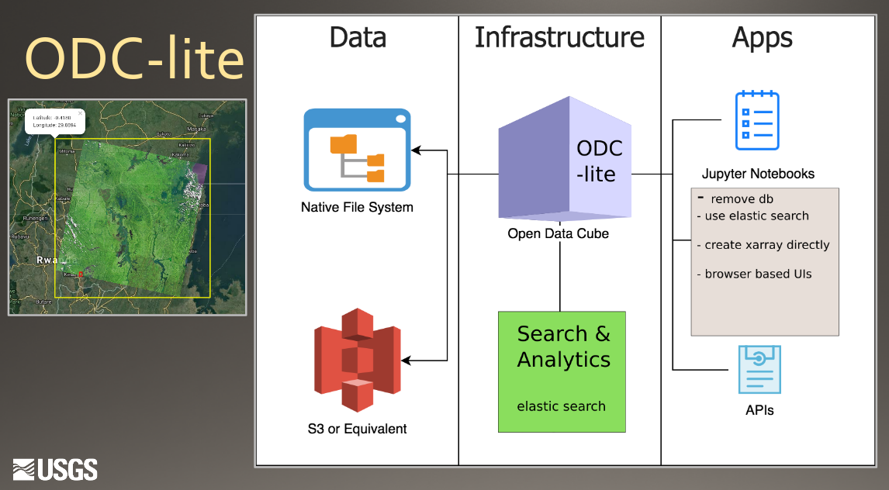

# Hello From Tony

## Looking Forward to Enhancment Proposal wiki

I will fill out the template once it is created for ODC-lite

```
 ____  ____  ____        _     _  _____  _____
/  _ \/  _ \/   _\      / \   / \/__ __\/  __/
| / \|| | \||  /  _____ | |   | |  / \  |  \  
| \_/|| |_/||  \__\____\| |_/\| |  | |  |  /_ 
\____/\____/\____/      \____/\_/  \_/  \____\
```


## ODC-IP #123 - Implement a simple ODC-lite package as a precursor for those interested in ODC

### Some folks might be scared off by the enormity/immensity of Open Data Cube

### Overview



Proposed By

#### Tony Butzer


*Assigned to Release: None* 
- this is standalone companion software outside of core.

This proposal is for a simple odc-lite repository

### State

    Under Discussion
     --> In Progress
    Completed
    Rejected
    Deferred

### Motivation

ODC has tremendous application potential.

However; ODC is difficult to install and has a huge dependency tree. Xarray concepts and jupyter notebooks may be foreign to most new ODC onlookers.

This package makes it so simple even a cave-man can run an ODC-lite ODC like notebook. Then once hooked more sophisticated applications can be acheived by using ODC.

This will be a separate repo - its documented here to fit into the bigger picture of ODC sponsored events and as part of the training package - titled "A gentle introduction to Open Data Cube; Your Data on Display"


### Project Steering Committee (Voting):

- Andrew Cherry (Chair)
- Alex Leith (FrontierSI)
- David Gavin (GA)
- Damien Ayers (GA)
- Luigi Di Fraia (Catapult)
- Peter Wang (Data61)
- Syed Rizvi (AMA)
- Randall Sunne (USGS): +1
- Tony Butzer (USGS): +1
- George Dyke (Symbios)

   

### Links
[Labahn's Cloud Deployments Presentation](https://docs.google.com/presentation/d/1MGpPrvwRUG8KGa9Brmlqi0-fLID8ITV8PXiTa9mVaw0/edit?ts=5c584ed7#slide=id.p)

[Example Rwanda Cube via ODC-lite](https://drive.google.com/open?id=1ud-L5NrdMNly-w9EV444cPpCMFSiDjUl)


